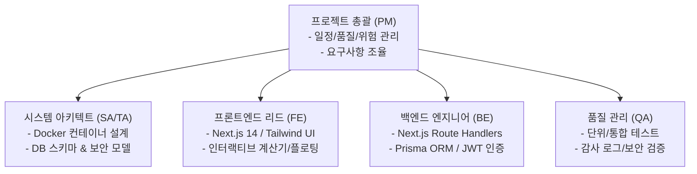
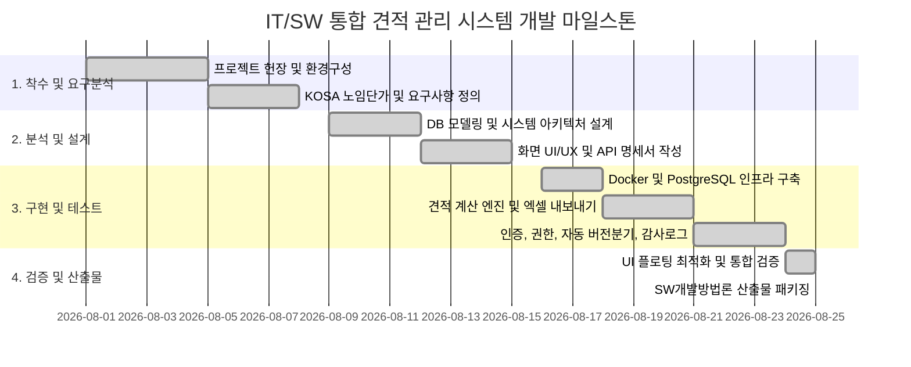

# [산출물-01] 사업수행계획서 및 프로젝트 헌장 (Project Charter & Execution Plan)

---

## 1. 프로젝트 개요

| 항목 | 내용 |
| :--- | :--- |
| **프로젝트명** | IT/SW 통합 견적 관리 시스템 (Smart Estimate Management System) |
| **프로젝트 코드** | EMS-2026-CORE |
| **개발 기간** | 2026. 08. 01 ~ 2026. 08. 25 (약 4주) |
| **주요 기술 스택** | Next.js 14 (App Router), TypeScript, Tailwind CSS, Prisma ORM, PostgreSQL 16, Docker |
| **목표 시스템** | KOSA SW 표준 대가산정 기반 실시간 견적 자동화, 고객사 전담 연락망, 버전 브랜칭, 사용자 인증 및 관리자 열람 감사 로그 시스템 구축 |

---

## 2. 추진 배경 및 목적

### 2.1 추진 배경
1. **수기 견적서 작성의 비효율 및 오류**: 엑셀 수기 계산 시 SW 기술자 노임단가 오기, 제경비·기술료·이윤율 공식 누락, 부가세 합산 오류 빈번 발생
2. **법적 근거 및 공고 기준 미비**: 한국소프트웨어산업협회(KOSA) 및 과기정통부 SW사업 대가산정 가이드라인 최신 기준 미반영
3. **고객사 및 프로젝트별 이력 관리 부재**: 고객사별 다중 프로젝트와 담당자 연락망(부서, 직책, 이메일, 전화번호) 파편화
4. **견적서 버전 제어 및 보안 미흡**: 네고 및 설계 변경 시 버전 추적 불가, 타 사용자 임의 수정에 따른 원본 훼손 위험, 견적서 열람/다운로드 이력 미관리

### 2.2 사업 목적
* **표준화된 자동 산출**: KOSA 표준 노임단가 공고 및 4대 요율(제경비 110%, 기술료 20%, 이윤 25% 이내, VAT 10%) 자동 연동
* **전담 연락망 통합**: 고객사별 프로젝트별 담당자 연락망 완벽 관리
* **지능형 버전 제어**: 원작성자 보호 및 타 사용자 수정 시 **v1.0 $\rightarrow$ v1.1 자동 마이너 버전 분기** 체계 확립
* **보안 및 감사 강화**: 시스템 관리자 전용 열람/인쇄/엑셀/수정 시도 실시간 감사 로그(Audit Log) 구축
* **컨테이너 기반 인프라**: Docker Compose를 통한 Next.js Standalone + PostgreSQL + Prisma Studio 무중단 패키징 배포

---

## 3. 프로젝트 추진 조직 및 R&R

| 역할 | 담당자 | 주요 업무 범위 |
| :--- | :--- | :--- |
| **PM (Project Manager)** | 홍길동 팀장 | 사업 총괄, 마일스톤 관리, 요구사항 정의, 이슈 및 위험 관리 |
| **SA / TA (System Architect)** | 김수석 수석 | 시스템 아키텍처 설계, Docker Compose 멀티 컨테이너 구축, PostgreSQL 인프라 |
| **FE (Frontend Developer)** | 이선임 선임 | 반응형 UI/UX, 슬림 플로팅 요율 패널, 2줄 카드형 품목 레이아웃, 인쇄/PDF 뷰 |
| **BE (Backend Developer)** | 박책임 책임 | Prisma 데이터 모델링, RESTful API 개발, JWT 쿠키 인증, 자동 버전 분기 엔진 |
| **QA / Tester** | 최연구 연구원 | 요구사항 추적 검증, 기능/통합 테스트, 보안 권한 검증, 산출물 패키징 |

---

## 4. 표준 개발 환경 및 기술 아키텍처

| 구분 | 요소 | 상세 규격 / 사양 |
| :--- | :--- | :--- |
| **Frontend** | Framework | Next.js 14.2.35 (React 18, App Router) |
| | Language | TypeScript 5.x |
| | Styling | Tailwind CSS 3.4, Lucide React (Icons) |
| **Backend** | Runtime | Node.js 20 (Alpine Linux LTS) |
| | API | Next.js Route Handlers (Serverless/Standalone) |
| | Auth | JWT (`jsonwebtoken`), Bcrypt (`bcryptjs`), HttpOnly Cookies |
| | Excel | ExcelJS (4개 표준 시트 자동 서식 생성) |
| **Database** | RDBMS | PostgreSQL 16 (Alpine) |
| | ORM | Prisma ORM 5.22.0 |
| | GUI Tool | Prisma Studio (Web GUI Port 5555) |
| **Infrastructure** | Container | Docker, Docker Compose (Multi-stage Standalone) |
| | Port | App (3300:3000), Studio (5555:5555), PostgreSQL (5432:5432) |
| | SCM | Git & GitHub (`https://github.com/boheni07/estimates.git`) |

---

## 5. 프로젝트 마일스톤 및 일정 계획

