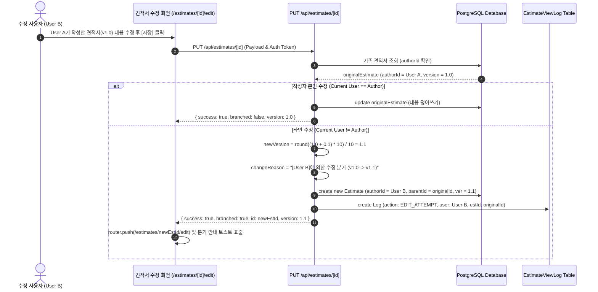
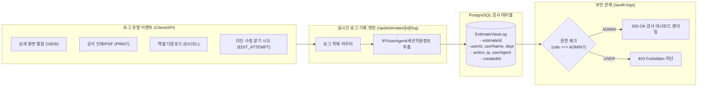

# [산출물-03] 시스템 아키텍처 및 소프트웨어 설계서 (System Architecture & SDD)

---

## 1. 아키텍처 개요 및 설계 원칙

본 시스템은 마이크로서비스 및 클라우드 네이티브 환경에 최적화된 **컨테이너 기반 Next.js Standalone + PostgreSQL 16 3-Tier 아키텍처**로 설계되었습니다.

```mermaid
graph TB
    subgraph Client["사용자 브라우저 (Client Tier)"]
        Browser["Next.js React 18 SPA Client<br/>- Tailwind CSS / Lucide React<br/>- React Hook State / Context API<br/>- Sticky Floating Panel / Print Media"]
    end

    subgraph DockerCompose["Docker 컨테이너 인프라 (Container Tier)"]
        subgraph AppContainer["1. App Service (estimate-app : Port 3300->3000)"]
            NextServer["Next.js Standalone Node.js 20 Server"]
            RouteHandlers["RESTful API Route Handlers"]
            AuthModule["JWT & Bcrypt Auth Guard"]
            CalcEngine["KOSA Calculation & Branch Engine"]
            ExcelEngine["ExcelJS Multi-sheet Generator"]
            PrismaClient["Prisma ORM Client 5.22"]
        end

        subgraph StudioContainer["2. Studio Service (estimate-studio : Port 5555)"]
            PrismaStudio["Prisma Studio Web DB GUI"]
        end

        subgraph DBContainer["3. DB Service (estimate-postgres : Port 5432)"]
            PostgreSQL["PostgreSQL 16 Alpine Database<br/>- Docker Volume: postgres_data<br/>- UTF-8 / Relational Tables"]
        end
    end

    Browser <-->|HTTP / JSON (REST API)<br/>HttpOnly Auth Cookie| NextServer
    Browser <-->|HTTP (Port 5555)| PrismaStudio
    NextServer --> RouteHandlers
    RouteHandlers --> AuthModule
    RouteHandlers --> CalcEngine
    RouteHandlers --> ExcelEngine
    RouteHandlers --> PrismaClient
    PrismaStudio --> PrismaClient
    PrismaClient <-->|TCP (Port 5432)<br/>PostgreSQL Connection Pool| PostgreSQL
```

---

## 2. Docker 멀티 컨테이너 구성 설계

| 컨테이너 서비스명 | 이미지 베이스 | 호스트 포트 : 컨테이너 포트 | 역할 및 설명 |
| :--- | :--- | :---: | :--- |
| **`app`** | `node:20-alpine` (Multi-stage Standalone) | `3300 : 3000` | Next.js 프로덕션 웹 애플리케이션 및 REST API 서버 |
| **`db`** | `postgres:16-alpine` | `5432 : 5432` | 견적 마스터/거래처/사용자/감사로그 저장 RDBMS |
| **`studio`** | `node:20-alpine` | `5555 : 5555` | 데이터베이스 브라우징 및 시각적 조작용 Prisma Studio Web GUI |

---

## 3. 핵심 비즈니스 로직 및 시퀀스 설계

### 3.1 사용자 인증 및 세션 검증 시퀀스 (JWT HttpOnly)

```mermaid
sequenceDiagram
    autonumber
    actor User as 사용자 (브라우저)
    participant Client as Next.js Client (AuthContext)
    participant API as /api/auth/login
    participant DB as PostgreSQL (User Table)

    User->>Client: ID / PW 입력 후 로그인 클릭
    Client->>API: POST /api/auth/login { username, password }
    API->>DB: findUnique({ where: { username } })
    DB-->>API: User Record (비밀번호 해시 반환)
    API->>API: bcrypt.compare(password, hash) 검증
    API->>API: jwt.sign(userPayload, JWT_SECRET, { expiresIn: '7d' })
    API-->>Client: 200 OK + Set-Cookie (estimate_auth_token; HttpOnly; SameSite=Lax)
    Client->>Client: setUser(authUser) & 페이지 이동 (/)
```

---

### 3.2 견적서 타인 수정 시 자동 마이너 버전(+0.1) 분기 시퀀스



---

### 3.3 관리자 전용 보안 감사 로그 (Audit Log) 설계



---

## 4. SW 대가산정 계산 수식 모델

본 시스템의 계산 엔진(`src/lib/calculator.ts`)은 과기정통부 및 KOSA의 소프트웨어사업 대가산정 가이드라인을 엄격히 준수합니다:

$$\text{직접인건비 (Labor Cost)} = \sum (\text{투입공수(M/M)} \times \text{등급별 월 기준단가})$$

$$\text{제경비 (Overhead Cost)} = \text{직접인건비} \times \frac{\text{제경비율 (기본 110\%)}}{100}$$

$$\text{기술료 (Technical Fee)} = (\text{직접인건비} + \text{제경비}) \times \frac{\text{기술료율 (기본 20\%)}}{100}$$

$$\text{직접경비 (Direct Expense)} = \sum \text{실비 항목 (여비교통비, 인쇄비, 장비임차료 등)}$$

$$\text{개발원가 (Development Cost)} = \text{직접인건비} + \text{제경비} + \text{기술료} + \text{직접경비}$$

$$\text{이윤 (Profit)} = (\text{개발원가} - \text{직접경비}) \times \frac{\text{이윤율 (25\% 이내)}}{100}$$

$$\text{SW용역 소계} = \text{개발원가} + \text{이윤}$$

$$\text{물품/솔루션 소계} = \sum (\text{수량} \times \text{단가} \times (1 - \frac{\text{할인율}}{100}))$$

$$\text{총 공급가액 (Supply Price)} = \text{SW용역 소계} + \text{물품 소계} - \text{특별할인액}$$

$$\text{부가가치세 (VAT)} = \text{총 공급가액} \times \frac{\text{부가가치세율 (10\%)}}{100}$$

$$\text{최종 견적 합계 (Grand Total)} = \text{총 공급가액} + \text{부가가치세}$$
