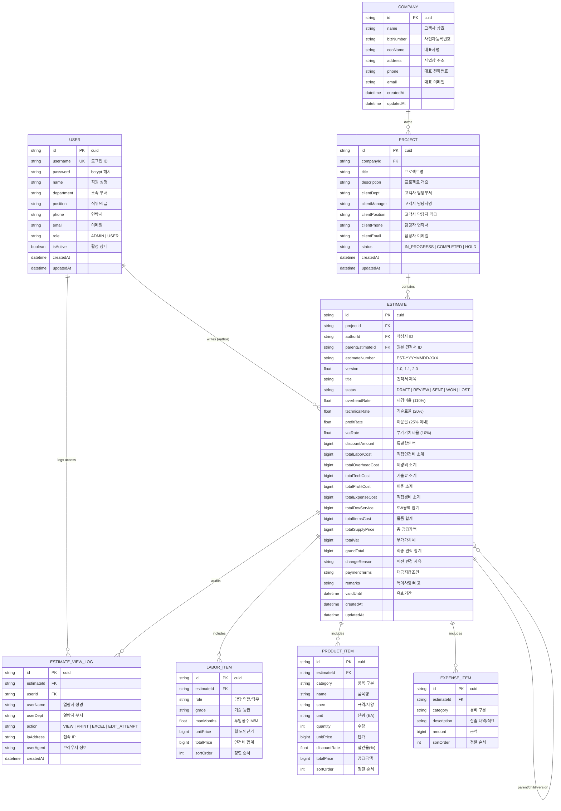

# [산출물-04] 데이터베이스 설계서 및 ERD (Database Design & Data Dictionary)

---

## 1. 데이터베이스 개요

* **DBMS**: PostgreSQL 16 (Relational Database)
* **인코딩**: UTF-8
* **ORM**: Prisma ORM 5.22.0
* **스키마 파일**: `prisma/schema.prisma`
* **주요 엔티티**: 사용자/직원(`User`), 감사로그(`EstimateViewLog`), 고객사(`Company`), 프로젝트(`Project`), 견적서(`Estimate`), 인건비(`LaborItem`), 물품(`ProductItem`), 직접경비(`ExpenseItem`), 마스터설정(`MasterSetting`), 기준노임단가(`StandardGradeRate`)

---

## 2. 개체-관계 다이어그램 (ERD: Entity-Relationship Diagram)

---

## 3. 상세 테이블 정의서 (Data Dictionary)

### 3.1 사용자/직원 테이블 (`User`)

| 컬럼명 | 물리 타입 | NULL | 기본값 | 설명 및 제약조건 |
| :--- | :--- | :---: | :---: | :--- |
| `id` | VARCHAR(30) | N | cuid() | 기본키 (Primary Key) |
| `username` | VARCHAR(50) | N | - | 로그인 ID (Unique) |
| `password` | VARCHAR(255) | N | - | 단방향 해시 비밀번호 (Bcrypt) |
| `name` | VARCHAR(50) | N | - | 직원 성명 |
| `department` | VARCHAR(50) | N | - | 소속 부서 |
| `position` | VARCHAR(50) | N | - | 직위 / 직급 |
| `phone` | VARCHAR(30) | Y | NULL | 전화번호 |
| `email` | VARCHAR(100) | Y | NULL | 이메일 주소 |
| `role` | VARCHAR(20) | N | 'USER' | 권한 (`ADMIN` \| `USER`) |
| `isActive` | BOOLEAN | N | true | 계정 활성화 여부 |
| `createdAt` | TIMESTAMP | N | now() | 등록일시 |
| `updatedAt` | TIMESTAMP | N | now() | 수정일시 |

---

### 3.2 열람 감사 로그 테이블 (`EstimateViewLog`)

| 컬럼명 | 물리 타입 | NULL | 기본값 | 설명 및 제약조건 |
| :--- | :--- | :---: | :---: | :--- |
| `id` | VARCHAR(30) | N | cuid() | 기본키 (Primary Key) |
| `estimateId`| VARCHAR(30) | N | - | 대상 견적서 ID (FK $\rightarrow$ `Estimate.id`, Cascade) |
| `userId` | VARCHAR(30) | Y | NULL | 열람자 사용자 ID (FK $\rightarrow$ `User.id`) |
| `userName` | VARCHAR(50) | N | - | 열람 당시 사용자 성명 |
| `userDept` | VARCHAR(50) | Y | NULL | 열람 당시 소속 부서 |
| `action` | VARCHAR(30) | N | 'VIEW'| 행동 구분 (`VIEW` \| `PRINT` \| `EXCEL` \| `EDIT_ATTEMPT`) |
| `ipAddress` | VARCHAR(50) | Y | NULL | 접속 IP 주소 |
| `userAgent` | TEXT | Y | NULL | 브라우저 및 디바이스 환경 |
| `createdAt` | TIMESTAMP | N | now() | 로그 발생 일시 |

---

### 3.3 고객사(거래처) 테이블 (`Company`)

| 컬럼명 | 물리 타입 | NULL | 기본값 | 설명 및 제약조건 |
| :--- | :--- | :---: | :---: | :--- |
| `id` | VARCHAR(30) | N | cuid() | 기본키 (Primary Key) |
| `name` | VARCHAR(100) | N | - | 고객사 상호/법인명 |
| `bizNumber` | VARCHAR(30) | Y | NULL | 사업자등록번호 |
| `ceoName` | VARCHAR(50) | Y | NULL | 대표자 성명 |
| `address` | VARCHAR(255) | Y | NULL | 사업장 주소지 |
| `phone` | VARCHAR(30) | Y | NULL | 대표 전화번호 |
| `email` | VARCHAR(100) | Y | NULL | 대표 이메일 |
| `createdAt` | TIMESTAMP | N | now() | 등록일시 |
| `updatedAt` | TIMESTAMP | N | now() | 수정일시 |

---

### 3.4 프로젝트 테이블 (`Project`)

| 컬럼명 | 물리 타입 | NULL | 기본값 | 설명 및 제약조건 |
| :--- | :--- | :---: | :---: | :--- |
| `id` | VARCHAR(30) | N | cuid() | 기본키 (Primary Key) |
| `companyId` | VARCHAR(30) | N | - | 소속 고객사 ID (FK $\rightarrow$ `Company.id`, Cascade) |
| `title` | VARCHAR(150) | N | - | 프로젝트 사업명 |
| `description`| TEXT | Y | NULL | 프로젝트 사업 개요 |
| `clientDept` | VARCHAR(50) | Y | NULL | 고객사 담당 부서 |
| `clientManager`| VARCHAR(50) | Y | NULL | 고객사 담당자 성명 |
| `clientPosition`| VARCHAR(50) | Y | NULL | 고객사 담당자 직위 |
| `clientPhone`| VARCHAR(30) | Y | NULL | 담당자 연락처 |
| `clientEmail`| VARCHAR(100) | Y | NULL | 담당자 이메일 |
| `status` | VARCHAR(20) | N | 'IN_PROGRESS' | 진행 상태 |
| `createdAt` | TIMESTAMP | N | now() | 등록일시 |
| `updatedAt` | TIMESTAMP | N | now() | 수정일시 |

---

### 3.5 견적서 마스터 테이블 (`Estimate`)

| 컬럼명 | 물리 타입 | NULL | 기본값 | 설명 및 제약조건 |
| :--- | :--- | :---: | :---: | :--- |
| `id` | VARCHAR(30) | N | cuid() | 기본키 (Primary Key) |
| `projectId` | VARCHAR(30) | N | - | 프로젝트 ID (FK $\rightarrow$ `Project.id`, Cascade) |
| `authorId` | VARCHAR(30) | Y | NULL | 작성자 직원 ID (FK $\rightarrow$ `User.id`) |
| `parentEstimateId`| VARCHAR(30) | Y | NULL | 원본 견적서 ID (버전 분기 시 FK) |
| `estimateNumber`| VARCHAR(50) | N | - | 견적서 일련번호 (`EST-YYYYMMDD-XXX`) |
| `version` | DOUBLE PRECISION | N | 1.0 | 견적서 버전 (`1.0`, `1.1`, `2.0` 등) |
| `title` | VARCHAR(200) | N | - | 견적서 제목 |
| `status` | VARCHAR(20) | N | 'DRAFT' | 상태 (`DRAFT`, `REVIEW`, `SENT`, `WON`, `LOST`) |
| `overheadRate`| DOUBLE PRECISION | N | 110.0 | 제경비율 (%) |
| `technicalRate`| DOUBLE PRECISION| N | 20.0 | 기술료율 (%) |
| `profitRate` | DOUBLE PRECISION| N | 25.0 | 이윤율 (25% 이내, %) |
| `vatRate` | DOUBLE PRECISION| N | 10.0 | 부가가치세율 (%) |
| `discountAmount`| BIGINT | N | 0 | 특별할인 차감액 (원) |
| `totalLaborCost`| BIGINT | N | 0 | 직접인건비 소계 (원) |
| `totalOverheadCost`| BIGINT | N | 0 | 제경비 소계 (원) |
| `totalTechCost`| BIGINT | N | 0 | 기술료 소계 (원) |
| `totalProfitCost`| BIGINT | N | 0 | 이윤 소계 (원) |
| `totalExpenseCost`| BIGINT | N | 0 | 직접경비 소계 (원) |
| `totalDevService`| BIGINT | N | 0 | SW용역 합계 (원) |
| `totalItemsCost`| BIGINT | N | 0 | 물품 및 라이선스 합계 (원) |
| `totalSupplyPrice`| BIGINT | N | 0 | 총 공급가액 (원) |
| `totalVat` | BIGINT | N | 0 | 부가가치세 (원) |
| `grandTotal` | BIGINT | N | 0 | 최종 견적 합계 (원) |
| `changeReason` | TEXT | Y | NULL | 버전 복제 / 타인수정 분기 사유 |
| `paymentTerms` | VARCHAR(255) | Y | NULL | 대금지급조건 |
| `remarks` | TEXT | Y | NULL | 특이사항 및 비고 |
| `validUntil` | TIMESTAMP | Y | NULL | 견적 유효기간 |
| `createdAt` | TIMESTAMP | N | now() | 발행일시 |
| `updatedAt` | TIMESTAMP | N | now() | 최종수정일시 |
