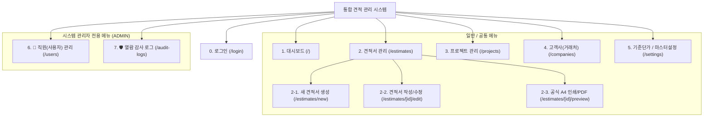

# [산출물-06] 화면 설계서 및 UI/UX 스토리보드 (UI Specification & Storyboard)

---

## 1. 메뉴 구조도 및 사이트맵 (Site Map)



---

## 2. 주요 화면별 와이어프레임 및 기능 상세

### 2.1 접기/펼치기 사이드바 (Collapsible Sidebar)
* **펼침 상태 (`w-64`)**: 로고, 시스템명, 메뉴 아이콘 + 텍스트, 관리자 배지, 접기 버튼(`PanelLeftClose`)
* **접힘 상태 (`w-20`)**: 아이콘 중앙 정렬, 마우스 호버 시 **플로팅 툴팁(Tooltip)** 노출, 펼치기 버튼(`PanelLeftOpen`)
* **상태 영속화**: `localStorage`를 통해 브라우저 새로고침 후에도 접힘 상태 유지

```
[펼침 상태: w-64]               [접힘 상태: w-20]
┌────────────────────────┐       ┌──────┐
│ [🧮] 통합 견적 관리 [◀]│       │ [🧮] │
│ ────────────────────── │       │ [▶]  │
│ [📊] 대시보드          │       │ ──── │
│ [📋] 견적서 관리       │       │ [📊] │ (Hover 시 '대시보드' 툴팁)
│ [➕] 새 견적서 작성    │       │ [📋] │
│ [📁] 프로젝트 관리     │       │ [📁] │
│ [🏢] 고객사(거래처)    │       │ [🏢] │
│ [⚙️] 기준단가/공급자   │       │ [⚙️] │
│ ────────────────────── │       │ ──── │
│ [🛡️] 시스템 관리자 전용│       │ [🛡️] │
│ [👥] 직원(사용자) 관리 │       │ [👥] │
│ [🚨] 열람 감사 로그    │       │ [🚨] │
└────────────────────────┘       └──────┘
```

---

### 2.2 견적서 작성/수정 화면 (`/estimates/[id]/edit`)
* **좌측 75% 넓은 작업 영역**:
  1. **SW 개발비 (직접인건비)**:
     - `담당 역할/직무` (넓게 확장)
     - `기술 등급` (콤보박스에 금액 제거하고 `총괄관리자(PM)` 최적 너비 `w-36` 지정)
     - `투입공수(M/M)` (`w-20`), `월 노임단가` (`w-28`), `인건비` (`w-32`)
  2. **물품 및 솔루션/라이선스 (2줄 카드형 레이아웃)**:
     - 1줄: `No` + `구분(패키지SW)` + `품목명(넓음)` + `규격/사양(넓음)` + `삭제`
     - 2줄: `단위(EA)` + `수량` + `단가(원)` + `할인율(%)` $\rightarrow$ `공급금액(₩)` 강조 뱃지
  3. **직접경비 (실비)**: 여비교통비, 인쇄비, 장비임차료 등
  4. **결제조건 및 비고**: 유효기간, 대금지급조건, 특약사항
* **우측 슬림 플로팅 요율 패널 (`xl:w-72 2xl:w-80`, Sticky Floating)**:
  - 스크롤 시 상단에 고정되어 항상 따라옴
  - **1줄씩 컴팩트 배치**: 제경비율(110%), 기술료율(20%), 이윤율(25%), 특별할인액(원), 부가세율(10%)
  - 세부 산출 내역(①~⑦) 및 최종 견적 합계 배너 실시간 업데이트

```
┌──────────────────────────────────────────────────────────┬────────────────────────┐
│ [←] 견적서 편집 (EST-20260824-001 v1.0 / 작성자: 홍길동) │ 🧮 견적 산출 및 요율   │
├──────────────────────────────────────────────────────────┼────────────────────────┤
│ [견적서 제목: 차세대 포털 구축 사업 견적서             ] │ [제경비율] [110]%      │
│                                                          │ [기술료율] [ 20]%      │
│ 🧑‍💻 1. SW 개발비 (직접인건비)        [총 3.0 M/M] [+추가] │ [이윤율  ] [ 25]%      │
│ ┌──┬──────────────┬────────┬──────┬───────┬──────┬───┐   │ [특별할인] [   0]원    │
│ │No│담당 역할/직무│기술등급│ 공수 │월 단가│합  계│ 🗑│   │ [부가세율] [ 10]%      │
│ ├──┼──────────────┼────────┼──────┼───────┼──────┼───┤   ├────────────────────────┤
│ │ 1│총괄 PM       │총괄(PM)│ 1.0  │1,150만│1,150만│ 🗑│   │ ① 직접인건비 ₩25,730,000│
│ │ 2│백엔드 개발리드│고급기술│ 2.0  │ 798만 │1,596만│ 🗑│   │ ② 제경비(110)₩28,303,000│
│ └──┴──────────────┴────────┴──────┴───────┴──────┴───┘   │ ③ 기술료(20) ₩10,806,600│
│                                                          │ ④ 이윤(25)   ₩16,209,900│
│ 📦 2. 물품 및 솔루션 / 라이선스 (2줄 카드형)   [+품목추가]│ ⑤ 직접경비    ₩ 1,500,000│
│ ┌─ [1] [패키지SW▼] [DBMS Enterprise Edition] [v19c] ─[🗑] │ ────────────────────── │
│ │  단위:[EA] 수량:[1] 단가:[1,000만원] 할인:[0]% ➔ 1,000만│ ⑦ 총공급가액 ₩93,549,500│
│ └───────────────────────────────────────────────────────┘ │ ⑧ 부가세     ₩ 9,354,950│
│                                                          ├────────────────────────┤
│ 🧾 3. 직접경비 (실비) 4. 결제조건 및 비고사항            │ 🏆 최종 합계 (VAT포함)  │
│                                                          │ ₩ 102,904,450          │
└──────────────────────────────────────────────────────────┴────────────────────────┘
```

---

### 2.3 공식 A4 인쇄 / PDF 출력 뷰 (`/estimates/[id]/preview`)
* **표준 공인 견적서 서식 레이아웃**:
  - 좌측: 수신 고객사 정보 (고객사명, 담당자, 연락처, 견적일자)
  - 우측: 공급자 인감 및 사업자등록번호, 상호, 대표자, 업태/종목
  - 중앙: **견적 총괄 금액 (한글 표기 + 아라비아 숫자 굵게 표기)**
  - 세부 1: SW 직접인건비 산출내역표 (직무, 등급, M/M, 단가, 인건비)
  - 세부 2: 제경비, 기술료, 이윤, 직접경비, 물품, 특별할인 집계표
  - 하단: 대금지급조건, 유효기간, 특약사항
  - 각주: **과기정통부 및 KOSA SW사업 대가산정 가이드라인 법적 근거 명시**
* **인쇄 최적화 (`@media print`)**: 헤더, 사이드바, 인쇄 버튼 자동 숨김 및 A4 1장에 정렬
