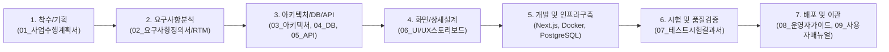

# 📚 SW 개발방법론 표준 산출물 패키지 (Software Deliverables Package)

본 디렉토리(`docs/`)는 **IT/SW 통합 견적 관리 시스템 (Estimate Management System)**의 소프트웨어 개발 생명주기(SDLC: Software Development Life Cycle) 전 과정에 걸쳐 작성된 **SW공학 표준 산출물 일체**를 수록하고 있습니다.

---

## 📑 산출물 목록 및 체계도 (Deliverables Index)

| 단계 | 산출물 번호 및 명칭 | 주요 기술 내용 | 파일 링크 |
| :---: | :--- | :--- | :---: |
| **착수/기획** | **[산출물-01] 사업수행계획서 및 프로젝트 헌장** | 프로젝트 개요, 추진 배경 및 목적, 추진 조직 및 R&R, 개발 환경, 마일스톤 | [01_PROJECT_CHARTER.md](./01_PROJECT_CHARTER.md) |
| **요구사항** | **[산출물-02] 요구사항 정의서 및 추적 매트릭스** | 기능(FR 14건)/비기능(NFR 5건) 요구사항 정의, 요구사항 추적 매트릭스(RTM) | [02_REQUIREMENTS_SPECIFICATION.md](./02_REQUIREMENTS_SPECIFICATION.md) |
| **분석/설계** | **[산출물-03] 시스템 아키텍처 및 소프트웨어 설계서** | 논리/물리 아키텍처, Docker 멀티 컨테이너 구성, JWT 인증/버전분기 시퀀스, 대가산정 수식 모델 | [03_SYSTEM_ARCHITECTURE.md](./03_SYSTEM_ARCHITECTURE.md) |
| **데이터베이스**| **[산출물-04] 데이터베이스 설계서 및 ERD** | 개체-관계 다이어그램(ERD), 10개 핵심 테이블 상세 데이터 사전(Data Dictionary) | [04_DATABASE_DESIGN.md](./04_DATABASE_DESIGN.md) |
| **인터페이스** | **[산출물-05] REST API 인터페이스 명세서** | 25개 RESTful API 엔드포인트 규격, Request/Response 스키마, HTTP 상태 코드 | [05_API_SPECIFICATION.md](./05_API_SPECIFICATION.md) |
| **화면설계** | **[산출물-06] 화면 설계서 및 UI/UX 스토리보드** | 사이트맵, 접기/펼치기 사이드바, 2줄 카드형 품목, 슬림 플로팅 요율 패널, A4 인쇄 뷰 | [06_UI_SPECIFICATION.md](./06_UI_SPECIFICATION.md) |
| **테스트/품질**| **[산출물-07] 테스트 계획서 및 시험 결과서** | 7개 영역 32개 테스트 케이스 시험 결과표, 단위/통합/보안 검증 결과 (100% Pass) | [07_TEST_REPORT.md](./07_TEST_REPORT.md) |
| **배포/운영** | **[산출물-08] 시스템 설치 및 배포/운영자 가이드** | 시스템 사양, Docker Compose 원클릭 실행, DB 자동 마이그레이션/시딩, 백업/복구 절차 | [08_DEPLOYMENT_GUIDE.md](./08_DEPLOYMENT_GUIDE.md) |
| **사용자** | **[산출물-09] 시스템 사용자 매뉴얼** | 로그인, 견적서 작성 요령, 버전 분기 및 복제, A4 인쇄/엑셀 내보내기, 관리자 직원/감사로그 매뉴얼 | [09_USER_MANUAL.md](./09_USER_MANUAL.md) |

---

## 🏛️ 표준 개발 수명주기 매핑 (SDLC Life Cycle Mapping)



---

## 🚀 빠른 시작 (Quick Start)

```bash
# 1. 저장소 클론
git clone https://github.com/boheni07/estimates.git
cd estimates

# 2. Docker 컨테이너 일괄 빌드 및 실행
docker compose up -d --build

# 3. 브라우저 접속
# - 웹 애플리케이션: http://localhost:3300 (ID: admin / PW: password)
# - 데이터베이스 GUI (Prisma Studio): http://localhost:5555
```
